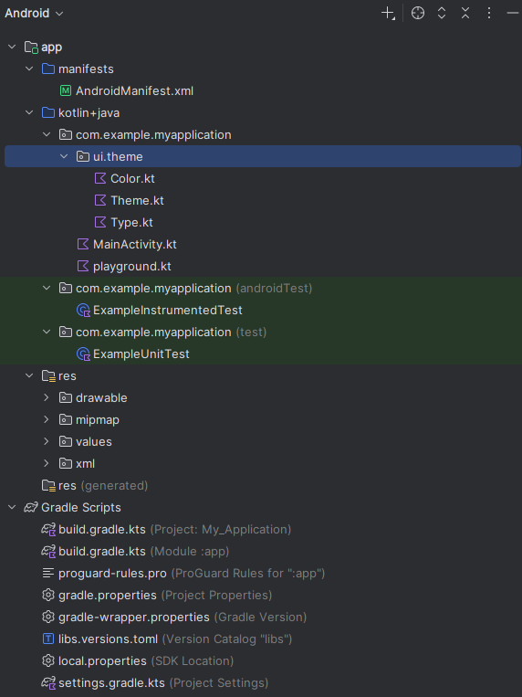

# Directorios de código fuente en Android

Un proyecto de Android organiza el **código fuente** y los recursos de manera estructurada para facilitar el desarrollo.

## Estructura principal

Los directorios más importantes son:

- **java/** → contiene el *código fuente* (clases y lógica de la app).  
- **res/** → archivos de recursos (*layouts*, *imágenes*, *strings*).  
- **AndroidManifest.xml** → define la configuración general de la aplicación.  

## Ejemplo de estructura

