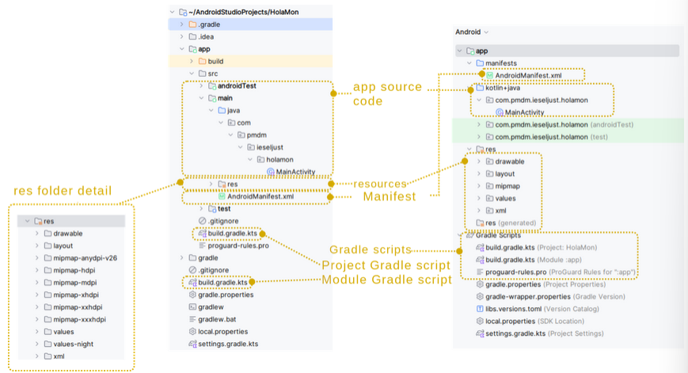

# Estructura de un proyecto en Gradle

Android Studio utiliza **Gradle** como herramienta de construcción de proyectos. Los proyectos de Android se organizan en módulos, donde cada módulo puede ser una aplicación diferente. Esto nos permite tener varias versiones de nuestra aplicación para distintos tipos de dispositivos (tabletas, wearables, etc.) dentro del mismo proyecto.



En esta imagen podemos ver la estructura que se genera en un proyecto de Android desde la vista lateral de herramientas y la vista **Android**.

## Configuración principal

El archivo *build.gradle (Project)* contiene la configuración global:

```gradle
buildscript {
    repositories {
        google()
        mavenCentral()
    }
    dependencies {
        classpath "com.android.tools.build:gradle:8.1.0"
    }
}
```